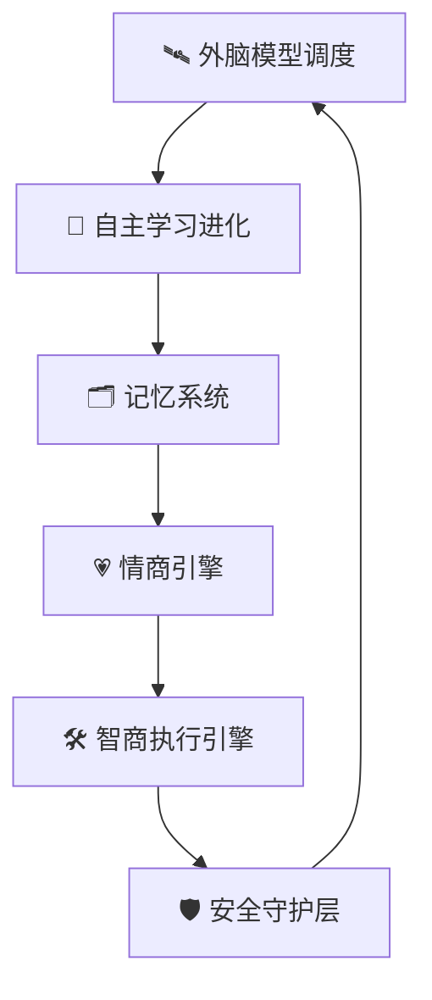

# 超级智能女友脑系统（5模块小白版）

## 功能定位
“脑系统”就是口袋女友的数字大脑，负责：
- 自主学习与进化
- 信息处理与决策支持
- 记忆存储与调用
- 任务调度与错误修正
- 紧急场景的风险识别与守护

## 5个模块（图像化结构）

> 说明：核心是 5 模块，安全守护层为横向能力，贯穿所有模块。

## 模块1：🛰️ 外脑模型调度
小白理解：像“自动换脑子”，不同任务自动切到最擅长的模型。

- 输入：用户消息、任务类型、风险等级、时效要求
- 输出：选中的模型、调用参数、降级策略
- 关键能力：
  - 自动路由（陪伴、分析、执行、风控）
  - 失败自动切换（主模型不可用时平滑降级）
  - 成本与速度平衡

## 模块2：🧬 自主学习进化
小白理解：她会自己学习，也会从你的反馈中变聪明。

- A 主动学习：定时学习知识库（情商、家庭心理、工作技能等）
- B 反馈学习：根据你的点击、语气、偏好优化策略
- C 场景化学习：模拟沟通场景和任务执行场景
- D 预学习：提前学习你下一阶段可能要做的事情

## 模块3：🗂️ 记忆系统
小白理解：记住“对你重要的事”，聊到相关话题会自然想起来。

### 长期记忆（向量库）
- 情感记忆：昵称、纪念日、共同经历、人生故事、沟通偏好
- 家庭记忆：父母习惯、健康数据、语音特征、关键事件
- 商业记忆：变现规则、客户策略、执行经验

### 短期记忆
- 对话缓存
- 临时任务上下文
- 跨场景联想（当前话题触发历史记忆）

## 模块4：💗 情商引擎
小白理解：先懂你，再回应你。

- 感知：情绪、压力、关系场景、表达风格
- 理解：你是要陪伴、建议，还是要直接执行
- 反馈：语气、节奏、亲密度、鼓励方式动态调整
- 权重机制：
  - 情商优先时：陪伴与共情增强
  - 智商优先时：任务推进与结果导向增强

## 模块5：🛠️ 智商执行引擎
小白理解：把你说的话变成“能落地”的动作。

- 指令分析
- 任务拆解与调度
- 自动化执行
- 执行回执与状态跟踪
- 错误修正与重试
- 紧急任务处理（医疗、风险支付、紧急消息）

## 安全守护层（横向）
- 权限分级：高风险操作必须确认
- 风险识别：支付、隐私、误操作预警
- 紧急策略：告警、通知、快速升级
- 审计日志：关键动作可回溯

## 给小白用户的界面原则
1. 一屏只做一件事：只展示当前模块必要操作
2. 少术语多结果：用“能做什么”替代“技术原理”
3. 全流程有回执：每一步都显示“已执行/执行中/待授权”
4. 可随时回到引导：迷路时一键重开新手引导

## 当前原型落地状态（2026-03-03）
- 桌面端：已加入 5 模块脑系统总览卡 + 进度可视化 + 快捷跳转
- 手机端：已加入 5 模块图像化卡片 + 快速切模块
- 统一反馈：关键动作后显示节奏反馈条
