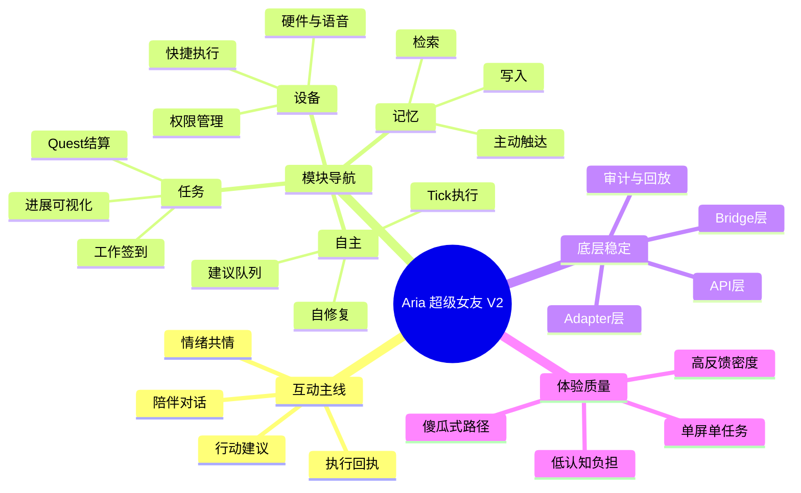
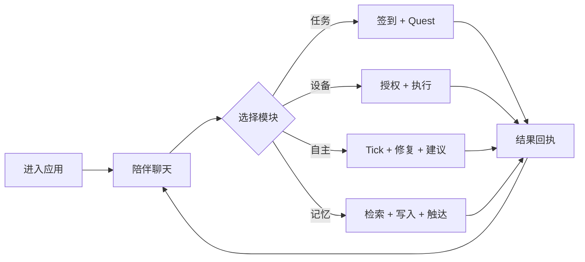

# Aria UX Prototype v2（桌面 + 手机）

## 1) 本版目标（针对“看不懂、按钮乱、模块杂”）
- 把复杂能力折叠成 **4 个可理解模块**：记忆 / 任务 / 设备 / 自主。
- 保留聊天主线，让用户始终知道“下一步该做什么”。
- 强化“真人互动感”：先情绪反馈，再行动建议，再结果回执。
- 底层继续走稳定链路：UI -> Mock API -> Bridge -> Adapter（可审计、可回放）。

## 2) 傻瓜式使用路径（3 步）
1. **先聊**：在陪伴区说出状态（压力、目标、情绪）。
2. **选模块**：点“任务 / 设备 / 自主 / 记忆”之一，只看当前模块必要动作。
3. **看回执**：每次执行都有状态反馈（已规划 / 执行中 / 已完成 / 待授权）。

## 3) 桌面 IA（V2）
- 左侧：人格化头像 + 身体热区（头=记忆，手=任务，脚=设备）
- 顶部：模式切换（陪伴/工作/亲情）+ 网络状态
- 中部：
  - 一级模块标签：陪伴 / 任务 / 设备 / 自主 / 记忆
  - 二级引导条：当前模块说明 + 1~5步骤按钮
- 内容区：
  - 陪伴：纯聊天流
  - 任务：签到、Quest、结算
  - 设备：授权、快捷执行、硬件/语音、任务回执
  - 自主：自主 Tick、自修复、建议队列
  - 记忆：检索、写入、主动触达建议

## 4) 手机 IA（V2）
- 主屏保持“聊天为中心”，右侧/下侧控制面板改为 **模块导航 + 单模块内容**。
- 控制面板顶部固定：
  - 模块标签（记忆/任务/设备/自主）
  - 当前模块提示语
- 控制面板中段：只显示当前模块动作，避免全量堆叠。
- 控制面板底部：刷新当前模块 + 重置。

## 5) 真人互动节奏（体验原型）
- **第一拍（情绪）**：Aria先回应感受（被理解）。
- **第二拍（推进）**：给一个可执行动作（不超过3个按钮）。
- **第三拍（奖励）**：完成后给进展反馈（XP、连击、任务状态）。
- **第四拍（期待）**：下一次触达建议（不过量，遵循预算/冷却）。

## 6) 脑图（功能与体验关系）

## 7) 关键页面原型流（可直接评审）

## 8) 本版验收口径
- 用户首次打开 30 秒内能说出“4个模块分别做什么”。
- 任一模块操作路径不超过 3 次点击。
- 所有执行动作都有可见状态回执。
- 无权限时给出明确“待授权”而非静默失败。
