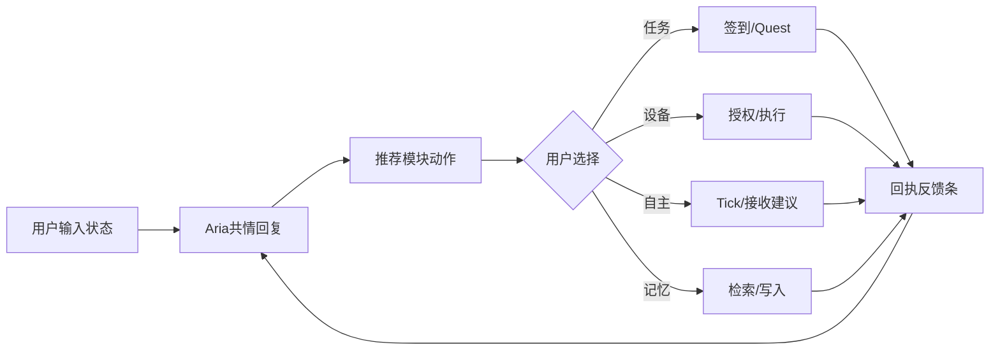

# Aria UX Prototype v3（互动节奏 + 新手引导 + 视觉统一）

## 本次目标
- 在 v2 的模块清晰基础上，进一步增强“真人陪伴的节奏感”。
- 首次使用时给出 3 步上手引导，降低学习门槛。
- 在桌面与手机端统一反馈语言：输入 -> 执行 -> 回执 -> 奖励提示。

## 交互节奏升级
1. 对话完成后给出轻量正反馈（可继续下一步）。
2. 任务签到、Quest 结算、设备执行、自主接收后都给统一回执提示。
3. 通过短时反馈条（toast/banner）维持节奏感，不打断主流程。

## 新手引导升级
- 桌面端：顶部引导卡（3步）
  - 第1步：陪伴对话
  - 第2步：任务签到与Quest
  - 第3步：设备授权与执行
- 手机端：头部引导卡 + 面板内“重新打开新手引导”。

## 视觉统一策略
- 桌面与手机都统一采用“米杏底 + 焦糖橙强调 + 浅绿成功反馈”语义。
- 模块都采用：标题 + 动作按钮 + 状态回执 的一致信息结构。
- 引导/反馈组件全部轻量化，不遮挡主聊天区。

## 体验主流程（v3）

## 验收点
- 首次打开 20 秒内用户能完成引导第 1 步。
- 任意模块动作完成后 3 秒内有明确回执反馈。
- 桌面与手机的模块语义、提示词、状态语言一致。
