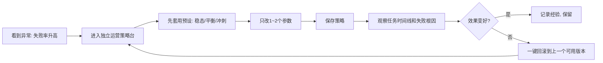

# 运营策略台-小白说明书

> 适用对象：身边没有工程师、希望自己独立运营 Aria 的产品负责人。
> 
> 路径入口：桌面端 -> 超级脑图 -> 脑系统策略配置 -> 独立运营策略台。

## 1. 这页是做什么的

你可以把它理解成“驾驶舱”：

- 左边是可视化参数（不用写代码）
- 中间是推荐值和风险说明（不懂技术也能调）
- 右边是变更记录（谁改的、改了什么、什么时候改）
- 底部支持一键回滚（出问题可快速恢复）

## 2. 一张图看懂流程

## 3. 参数怎么调（非技术版）

### 3.1 自治任务回退优先级

- 推荐：`code-specialist, companion-fallback`
- 作用：任务失败时，按顺序尝试下一个模型
- 风险：顺序乱了会“绕路”，失败重试增加

### 3.2 任务重试预算

- 推荐：`3`
- 作用：同一任务最多尝试几次
- 风险：
  - 太低：容易放弃可恢复任务
  - 太高：容易卡在坏任务上反复重试

### 3.3 重试退避

- 推荐：`1200ms`
- 作用：每次失败后等待多久再重试
- 风险：
  - 太短：重试风暴
  - 太长：响应变慢

### 3.4 熔断阈值 / 熔断冷却

- 推荐：`3次 / 45000ms`
- 作用：连续失败后，先暂停该链路，等恢复
- 风险：
  - 阈值太高：持续打爆坏链路
  - 阈值太低：误伤正常请求

### 3.5 长任务进度协议

- 推荐：`8秒触发, 30秒回报, 30秒阻塞上报`
- 作用：避免“看起来像卡死”
- 风险：
  - 阈值太大：用户误判系统失联
  - 阈值太小：消息刷屏

## 4. 三个预设怎么选

- 稳态运营：线上有波动、先保稳定
- 日常平衡：默认推荐，适合大多数情况
- 冲刺吞吐：短期追求速度（活动、高峰期）

建议：先用“日常平衡”，一次只改 1-2 个参数，观察一天再继续调。

## 5. 变更记录怎么读

策略变更记录会显示：

- 谁改了（修改人）
- 何时改的
- 改了哪些字段
- 风险等级（low / medium / high）
- 修改目的（你填的备注）

这意味着：

- 后续复盘有证据
- 团队协作不混乱
- 出问题能快速定位责任与上下文

## 6. 一键回滚什么时候用

建议在以下场景直接回滚：

- 保存后 10~30 分钟内失败率明显升高
- 队列死信持续增加
- 用户反馈“明显变慢/不执行”

两种回滚方式：

- 一键回滚到上一个可用版本（最安全）
- 在快照列表里定点回滚（高级运营）

## 7. 推荐运营 SOP（每天 5 分钟）

1. 看 readiness 和失败根因层级
2. 若异常，先切“稳态运营”预设
3. 记录本次改动目的（一句话）
4. 保存后观察 10-30 分钟
5. 无改善则一键回滚

## 8. 你要记住的核心原则

- 不追求“参数更激进”，先追求“连续可用”
- 每次只改少量参数，避免无法归因
- 任何调整都留痕：谁改、为何改、改了啥
- 能回滚的系统，才算可运营系统

